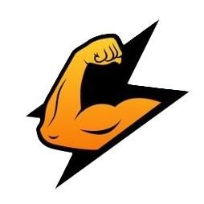
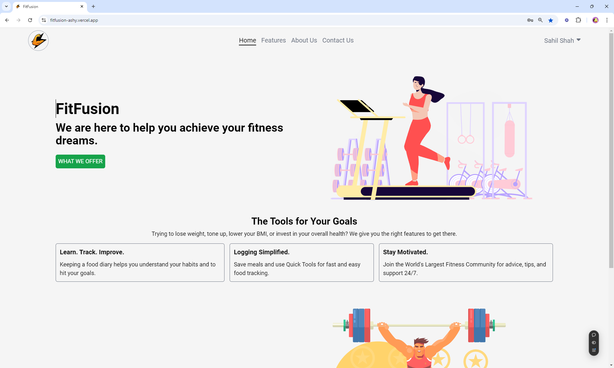
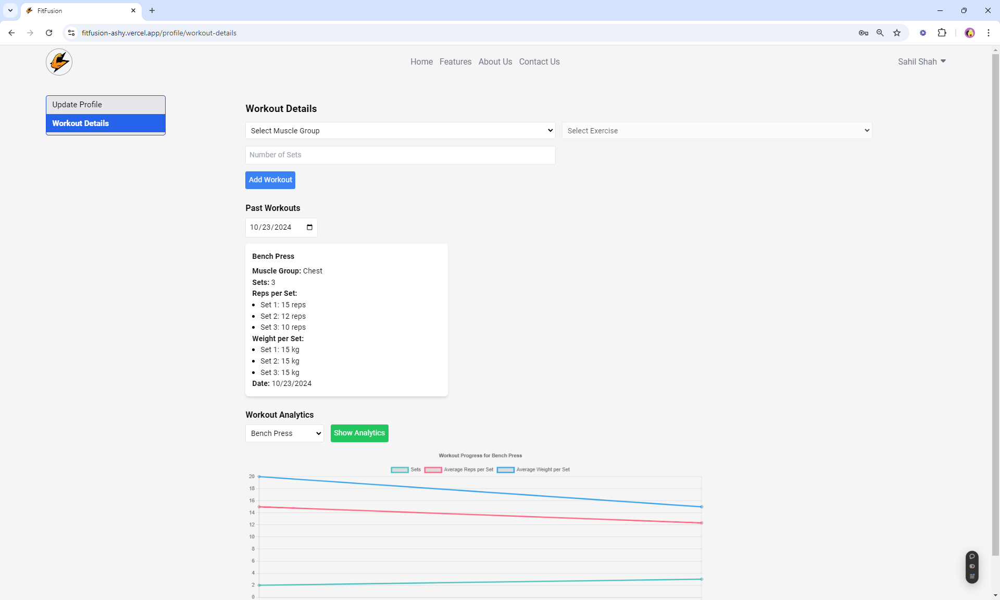
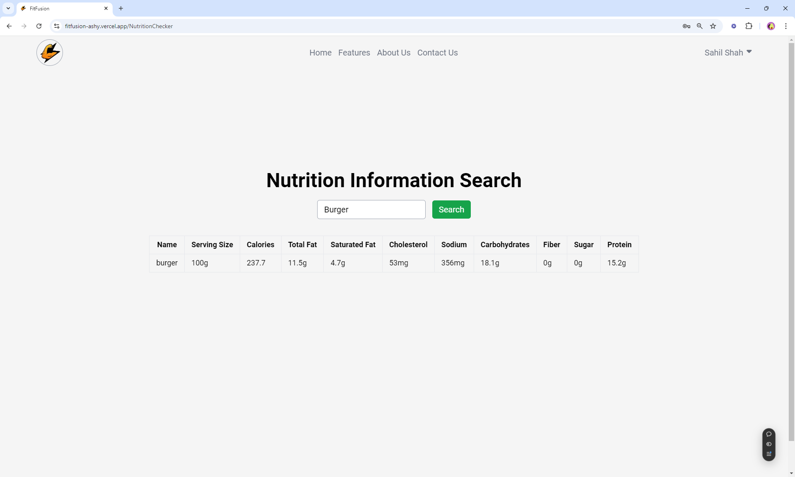
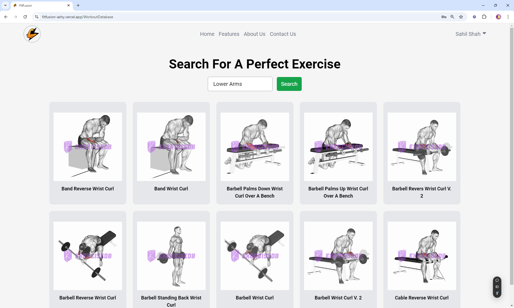
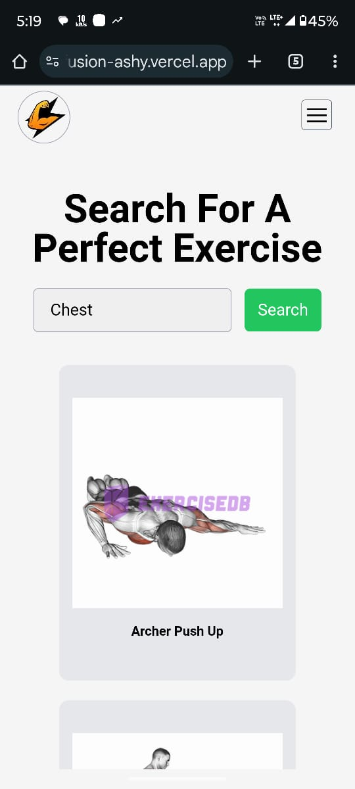
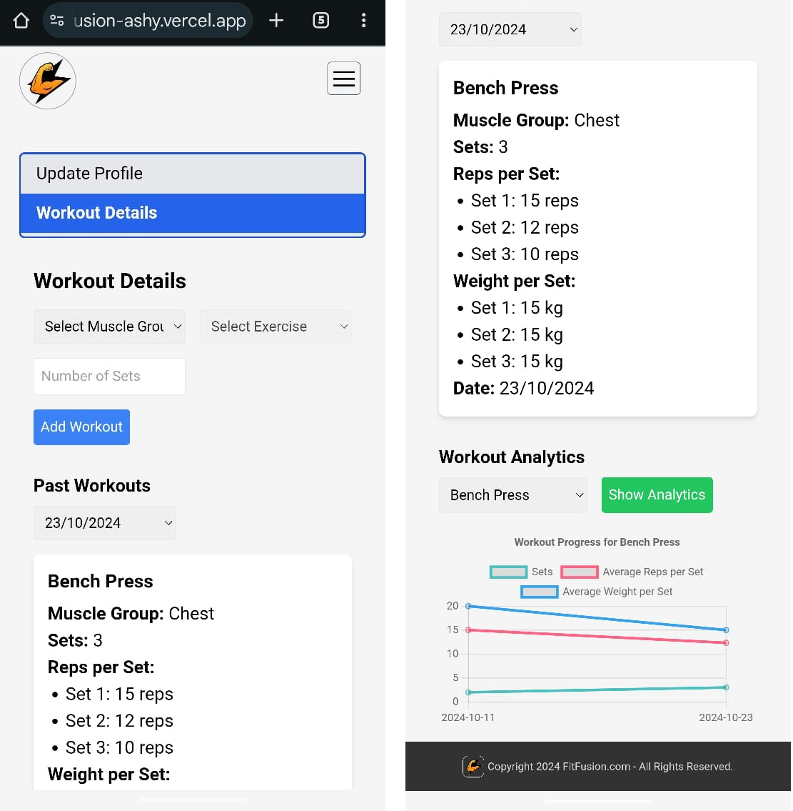
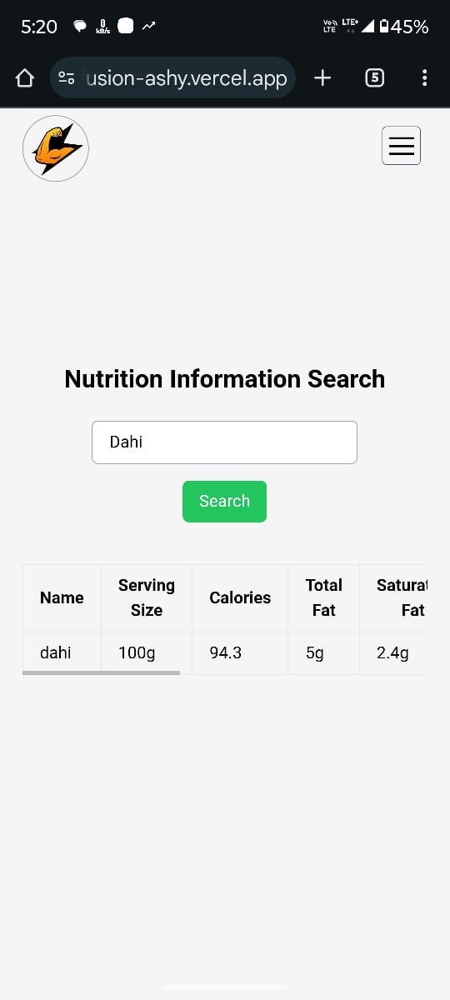
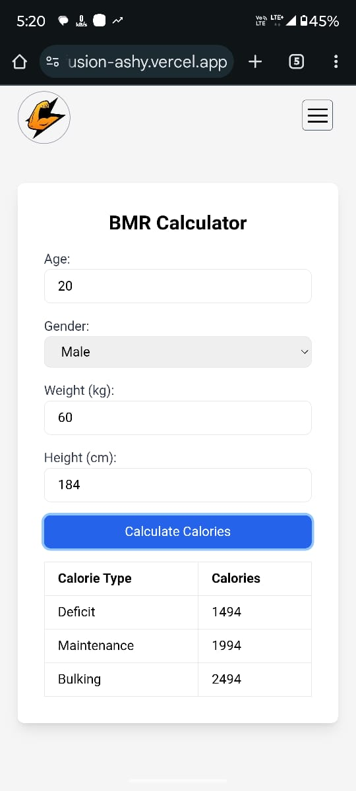

# FitFusion - Fitness Tracker App



## Table of Contents

- [Introduction](#introduction)
- [Features](#features)
- [Screenshots](#screenshots)
- [Mobile View Screenshots](#mobile-view-screenshots)
- [Technologies Used](#technologies-used)
- [Installation](#installation)
- [Usage](#usage)
- [Contributing](#contributing)
- [License](#license)

## Introduction

FitFusion is a comprehensive fitness tracker application designed to help users achieve their fitness goals. Whether you're looking to track workouts, monitor nutrition, or connect with a community, FitFusion has you covered.

## Features

- **User Authentication**: Secure sign-up and login process.
- **Workout Tracking**: Log workouts, sets, reps, and weights.
- **Nutrition Checker**: Search for food items and get nutritional information.
- **BMR Calculator**: Calculate your Basal Metabolic Rate and daily caloric needs.
- **Community Support**: Join a community of fitness enthusiasts for motivation and support.
- **Analytics**: View workout analytics and progress over time.

## Screenshots

### Main Page



### Workout Tracking



### Nutrition Checker



### BMR Calculator



## Mobile View Screenshots

### Mobile Main Page


### Mobile Workout Suggestion Page



### Mobile Workout Tracking



### Mobile Nutrition Checker



### Mobile BMR Calculator



## Deployed App

You can access the live application at: [FitFusion App](https://fitfusion-ashy.vercel.app)

## Technologies Used

- **Frontend**: React, Tailwind CSS, Framer Motion
- **Backend**: Node.js, Express, MongoDB
- **APIs**: Nutrition API, Exercise Database API
- **Deployment**: Vercel for frontend, Render for backend

## Installation

To run the project locally, follow these steps:

1. Clone the repository:

   ```bash
   git clone https://github.com/SahilS1903/fitness-tracker-.git
   ```

2. Navigate to the frontend directory:

   ```bash
   cd fitfusion/frontend
   ```

3. Install dependencies:

   ```bash
   npm install
   ```

4. Navigate to the backend directory:

   ```bash
   cd ../backend
   ```

5. Install backend dependencies:

   ```bash
   npm install
   ```

6. Create a `.env` file in the backend directory and add your environment variables.

7. Start the backend server:

   ```bash
   npm run dev
   ```

8. Start the frontend development server:
   ```bash
   cd ../frontend
   npm run dev
   ```

## Usage

- Open your browser and navigate to `http://localhost:3000` to access the app.
- Create an account or log in to start tracking your fitness journey.

## Contributing

Contributions are welcome! Please follow these steps to contribute:

1. Fork the repository.
2. Create a new branch (`git checkout -b feature/YourFeature`).
3. Make your changes and commit them (`git commit -m 'Add some feature'`).
4. Push to the branch (`git push origin feature/YourFeature`).
5. Open a pull request.


